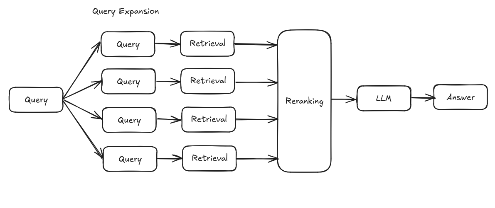

A streamlined Retrieval-Augmented Generation (RAG) application that demonstrates how to build an AI-powered document Q&A system. This application allows users to upload PDF documents and ask questions about their content. Built with FastAPI, it's designed for easy deployment to Hugging Face Spaces.

## Schema
